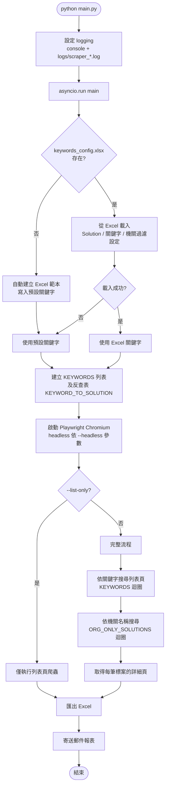
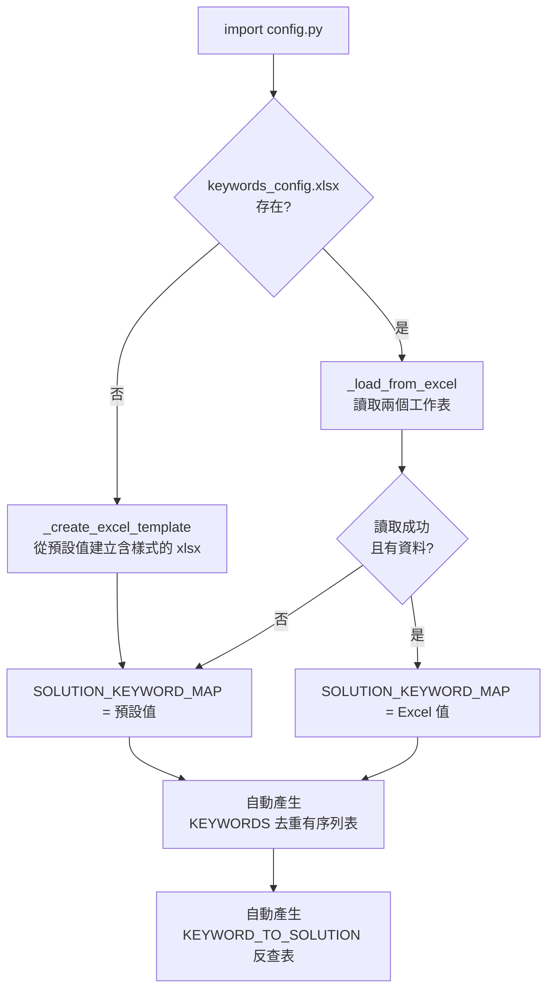
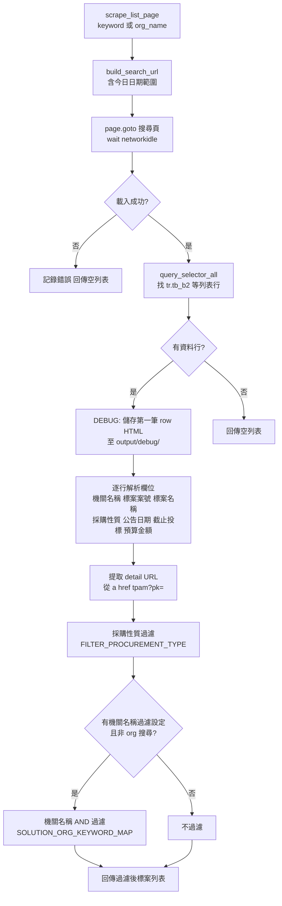
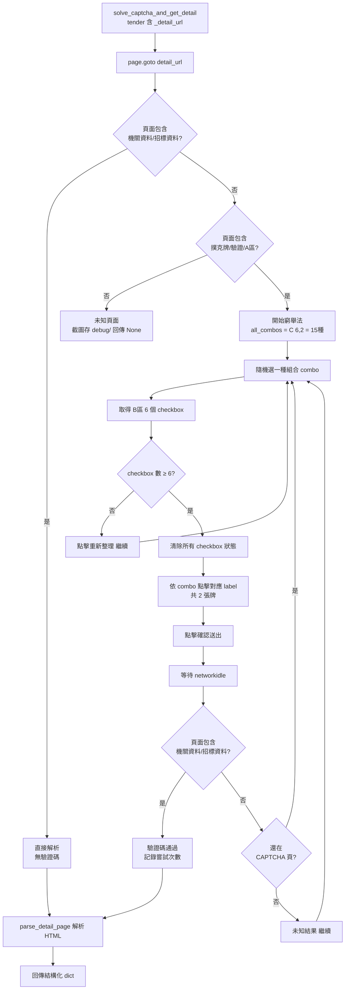
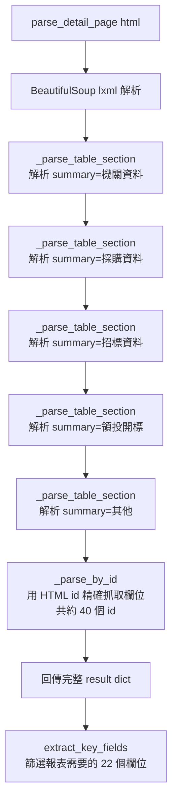
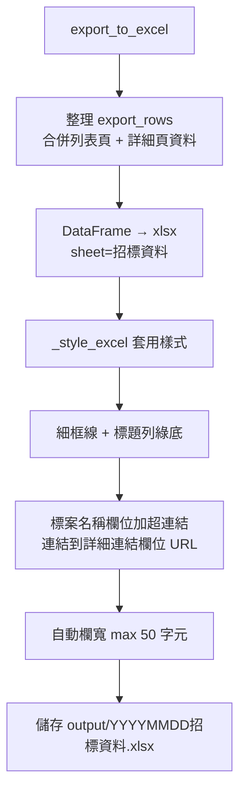
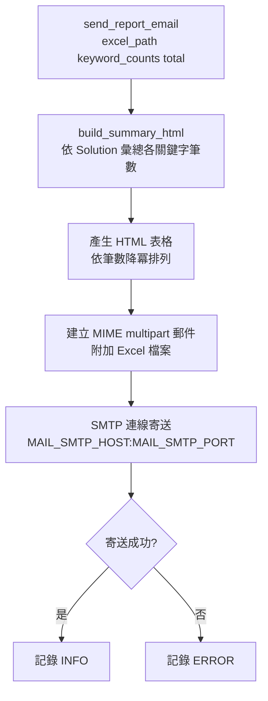

# V3 程式邏輯與流程說明

## 整體架構

```
main.py
├── 設定 logging（console + 日誌檔）
└── 呼叫 scraper_v2.main()
    ├── src/config.py          — 載入關鍵字設定
    ├── src/scraper_v2.py      — 主爬蟲（Playwright）
    │   ├── scrape_list_page() — 搜尋列表頁
    │   ├── solve_captcha_and_get_detail() — 驗證碼 + 詳細頁
    │   └── export_to_excel()  — 輸出報表
    ├── src/detail_parser.py   — 詳細頁 HTML 解析
    └── src/mail_sender.py     — 郵件寄送
```

---

## 主要流程圖



---

## 1. 設定載入（`src/config.py`）



**兩個工作表：**

| 工作表 | 欄位 | 用途 |
|---|---|---|
| 關鍵字設定 | Solution名稱、關鍵字 | 標案名稱搜尋關鍵字 |
| 機關過濾 | Solution名稱、機關關鍵字、僅機關搜尋 | 搜尋結果的機關名稱過濾條件 |

---

## 2. 列表頁爬蟲（`scrape_list_page`）



**搜尋 URL 結構（`BASE_URL`）：**
- `tenderType=TENDER_DECLARATION`（招標公告）
- `dateType=isNow`（當天）
- `tenderName=<keyword>` 或 `orgName=<org_name>`

---

## 3. 驗證碼破解 + 詳細頁（`solve_captcha_and_get_detail`）



**撲克牌驗證碼原理：**
- 頁面顯示 A 區（題目牌）和 B 區（6 張牌，需選出 2 張匹配的）
- 本程式使用**隨機窮舉法**：從 C(6,2)=15 種組合中隨機選一種
- 每次命中率約 1/15（≈6.7%），期望嘗試次數約 15 次
- 伺服器每次提交失敗後會更換驗證碼，程式持續重試

---

## 4. 詳細頁解析（`src/detail_parser.py`）



**`_parse_table_section` 邏輯：**
- 找 `table[summary=區塊名稱]`
- 逐 `<tr>` 解析 label cell（class: tbg_1/4/5/6/7）和 value cell（class: tbg_2/tbg_4R）
- `_parse_by_id` 的結果會**覆蓋** table 解析的同名欄位（更可靠）

---

## 5. Excel 匯出（`export_to_excel`）



**輸出欄位（共 28 欄）：**

| 來源 | 欄位 |
|---|---|
| 列表頁 | 項次、相關的Solution、關鍵字、機關名稱、標案案號、標案名稱、傳輸次數、招標方式、採購性質、公告日期、截止投標、預算金額、詳細連結 |
| 詳細頁 | 機關代碼、單位名稱、機關地址、聯絡人、聯絡電話、電子郵件信箱、標的分類、採購金額級距、辦理方式、決標方式、招標狀態、開標時間、開標地點、是否訂有底價、履約地點 |

---

## 6. 郵件寄送（`src/mail_sender.py`）



---

## 執行模式對照

| 指令 | 行為 |
|---|---|
| `python main.py` | 完整流程：列表頁 + 驗證碼 + 詳細頁 + Excel + 郵件 |
| `python main.py --headless` | 同上，但瀏覽器不顯示視窗 |
| `python main.py --list-only` | 只爬列表頁，不解驗證碼、不取詳細頁、不寄信 |

---

## 檔案輸出

```
v3/
├── logs/
│   └── scraper_YYYYMMDD_HHMMSS.log   # 執行日誌
├── output/
│   ├── YYYYMMDD招標資料.xlsx           # 報表
│   └── debug/
│       ├── list_row_debug_<keyword>.html  # 列表頁第一筆 row（除錯）
│       └── unknown_<案號>.png            # 未知頁面截圖（除錯）
└── keywords_config.xlsx               # 使用者維護的關鍵字設定
```
